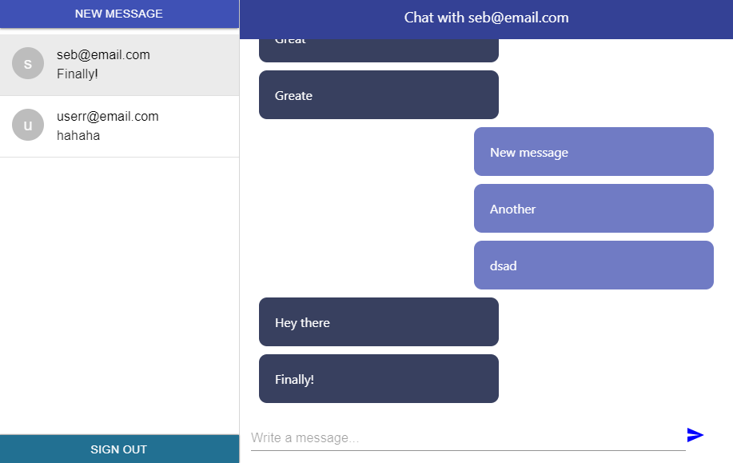

# Chat App - React

This is a React web chat application that allows users to message another user directly, create new messages with users they haven't chatted with before, sign up for an account, log in and log out of the application.

## Live Demo

[View Live Demo](https://master.d2784691w8uqct.amplifyapp.com/)

NOTE: You can test the app with "testuser@email.com" as the email and "testpass" as the password.

## Screenshot

## Features & Usage

- If the user is not logged in they are redirected to the login page.
- If they are already logged in, they are redirected from the login page to the dashboard/chat list.
- Messages and message previews are updated as soon as the message is sent.
- Users get an alert icon for new messages and it disappears when clicking the message.
- A user can create a new chat with people they haven't messaged yet.
- If the user tries to create a new chat with someone they already have a chat with, they just get redirected and their message is sent in the original chat.

## Potential Features

- Change the location of the log out button.
- Display a list of users/contacts.
- Make the design responsive.

## Setup

1. Clone this repository and access the project's directory.
2. Run "yarn install".
3. Run "npm start" to work on the development server.
4. Run "npm run build" once the project is ready for production.

## Built With

- JavaScript/ES6
- React
- Firebase Authentication
- Firebase Cloud Firestore
- Material-UI
- AWS Amplify

## Author

👤 **Sebastian Gil Rodriguez**

- Github: [@sebGilR](https://github.com/sebGilR)
- Twitter: [@sebGilR](https://twitter.com/sebGilR)
- Linkedin: [sebastiangilrodriguez](https://www.linkedin.com/in/sebastiangilrodriguez)

## 🤝 Contributing

Contributions, issues and feature requests are welcome!

Feel free to check the [issues page](https://github.com/sebGilR/chat_app/issues).

## Show your support

Give a ⭐️ if you like this project!
